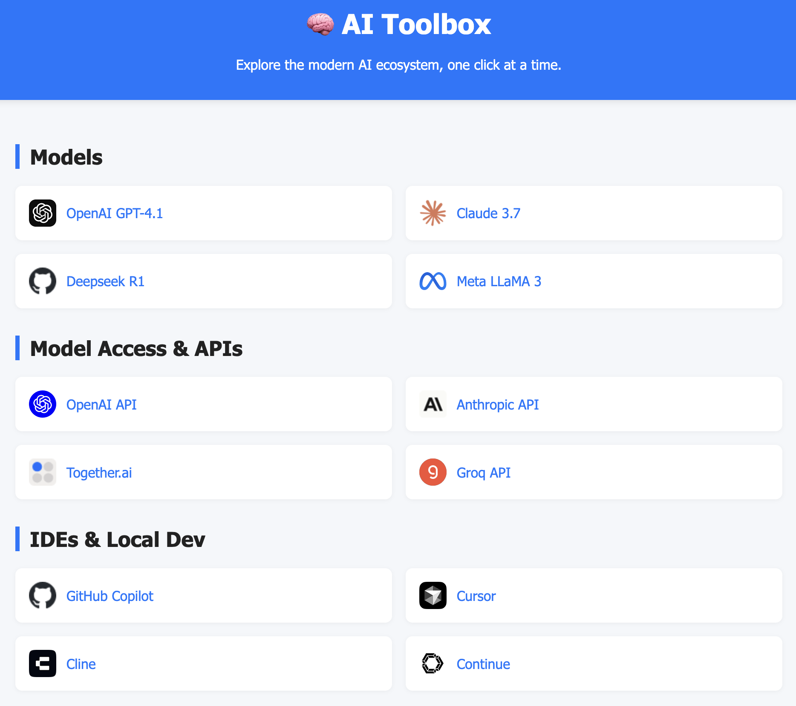

# AI Toolbox


## Description
AI Toolbox is a web application that provides a curated list of AI models, APIs, tools, and resources to help users explore the modern AI ecosystem.

## Features
- Explore various AI models and their access points.
- Suggest links to be added to the toolbox.
- User-friendly interface with a modal form for suggestions.

## Installation
To run this project locally, clone the repository and open `index.html` in your web browser.

```bash
git clone https://github.com/philpoore/ai-toolbox.git
cd ai-toolbox
open index.html
```

## Usage
Simply navigate through the sections to explore different AI models, APIs, and tools. Use the "Suggest a Link" button to submit your suggestions.

## Contributing
Contributions are welcome! Please open an issue or submit a pull request.

## License
This project is licensed under the MIT License.
